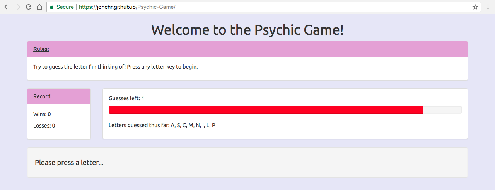

# Psychic-Game
A letter-guessing game demonstrating basic Bootstrap and Javascript. This app creates a static webpage containing the game. A live version can be found at: https://jonchr.github.io/Psychic-Game/

## Description

The goal when playing this game is to guess the specific letter that has been randomly selected. To play, you simply need to press any letter on your keyboard. You have up to nine attempts to guess the letter before you lose. Non-letter buttons and previously guessed letters do not count towards your attempts. Upon win or loss, the letter is revealed and the next game is automatically started. The player will receive specific win or loss messages based on their total number of wins or losses in the session. Leaving or resetting the page will reset any previously stored data.

### Development

This game was developed as part of the GW Coding Bootcamp and was completed within the second week. This project was built using HTML5, CSS3 with Bootstrap 3.3.7, and plain Javascript.

### Organization

To run the game locally on your own computer, you can run the following in command line:

		git clone https://github.com/jonchr/Psychic-Game.git
		cd Psychic-Game
		open index.html

Upon cloning to your local machine, you can change the layout by editing index.html, the formatting in assets/css/style.css, or the functionality in assets/javascript/game.js.

## Screenshots
### The Psychic Game

### You have one attempt left - make the most of it

